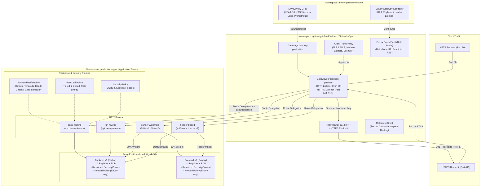

# Production-Grade Kubernetes Gateway API with Envoy Gateway

[-blue.svg)](https://gateway-api.sigs.k8s.io/)
[](https://gateway.envoyproxy.io/)
[](https://kubernetes.io/docs/concepts/security/pod-security-standards/)
[](LICENSE)

An enterprise-ready, production-hardened reference architecture demonstrating how to deploy, secure, and manage the **Kubernetes Gateway API** using **Envoy Gateway**.

---

## 1. Architecture Overview

This implementation enforces the **role-oriented separation of concerns** defined by the Kubernetes Gateway API specification, separating responsibilities across dedicated namespaces.



---

## 2. Role-Oriented Separation of Concerns

| Persona | Namespace | Responsibilities & Resources Owned |
| :--- | :--- | :--- |
| **Cluster / Infrastructure Admin** | `envoy-gateway-system` | • Install & maintain Envoy Gateway controller via Helm.<br/>• Manage cluster-wide CRDs.<br/>• Configure `EnvoyProxy` data plane templates (HPA, logging, Prometheus metrics). |
| **Platform / Network Operator** | `gateway-infra` | • Owns `GatewayClass` (`eg-production`) & `Gateway` (`production-gateway`).<br/>• Configures listeners (HTTP port 80, HTTPS port 443 with TLS termination).<br/>• Governs namespace route attachment using `allowedRoutes.namespaces.from: Selector`.<br/>• Enforces `ClientTrafficPolicy` (TLS versions, ciphers, client IP detection) & `ReferenceGrant`. |
| **Application Developer** | `production-apps` | • Defines `HTTPRoute` rules (paths, hostnames, canary weights, URL rewrites).<br/>• Tunes application resilience via `BackendTrafficPolicy` (retries, timeouts, circuit breaking).<br/>• Configures `RateLimitPolicy` and `SecurityPolicy` (CORS).<br/>• Deploys hardened microservices with PDBs and NetworkPolicies. |

---

## 3. Repository Structure

```
kubernetes-api-gateway/
├── 00-crds-and-controller/
│   ├── helm-values.yaml                  # HA controller values, leader election, resource limits
│   └── install.sh                        # Automated idempotent installation script
├── 01-platform-infrastructure/
│   ├── namespaces.yaml                   # Multi-tenant namespaces with Pod Security Standards (Restricted)
│   ├── envoy-proxy-config.yaml           # EnvoyProxy CRD: HPA 2-10, multi-zone anti-affinity, JSON logging
│   ├── gateway-class.yaml                # GatewayClass bound to EnvoyProxy parametersRef
│   └── cert-manager/
│       └── cluster-issuer.yaml           # ClusterIssuer & wildcard TLS Certificate definitions
├── 02-gateway-fleet/
│   ├── gateway.yaml                      # Dual-listener Gateway (Port 80 redirect + Port 443 TLS)
│   ├── client-traffic-policy.yaml        # TLS 1.2/1.3 cipher hardening & X-Forwarded-For trusted hops
│   └── reference-grant.yaml              # ReferenceGrant for cross-namespace Secret & Service trust
├── 03-resilience-and-security-policies/
│   ├── backend-traffic-policy.yaml       # Active health checks, 3 retries with backoff, circuit breaking
│   ├── rate-limit-policy.yaml            # Tiered (free/premium) and default local rate limiting
│   └── security-policy.yaml              # CORS origin validation & exposed response headers
├── 04-workloads/
│   ├── backend-v1/
│   │   ├── deployment.yaml               # 3 Replicas, non-root, read-only rootfs, startup/liveness/readiness probes
│   │   ├── service.yaml                  # ClusterIP Service with appProtocol: http
│   │   ├── service-account.yaml          # Zero-trust ServiceAccount (unmounted tokens)
│   │   ├── pdb.yaml                      # PodDisruptionBudget (minAvailable: 1)
│   │   └── network-policy.yaml           # Traffic isolation (only allows ingress from Envoy pods)
│   └── backend-v2/                       # Canary deployment with identical hardening standards
│       ├── deployment.yaml
│       ├── service.yaml
│       ├── pdb.yaml
│       └── network-policy.yaml
├── 05-routes/
│   ├── basic-routing.yaml                # Hostname matching with security response headers injected
│   ├── url-rewrite.yaml                  # Prefix (/api/v1/echo -> /) and full path rewrites
│   ├── canary-weighted.yaml              # 90/10 weighted production traffic splitting
│   └── header-based-routing.yaml         # A/B testing via HTTP request header (X-Canary: true)
├── Makefile                              # Automation commands (lint, deploy, test, clean)
└── README.md                             # Production architectural documentation
```

---

## 4. Quickstart Deployment Guide

### Prerequisites
- A Kubernetes cluster (v1.28+) (e.g., EKS, GKE, AKS, or local `kind` / `minikube`)
- `kubectl` v1.28+
- `helm` v3.12+

### Step 1: Validate Manifests
Verify that all YAML files are valid and conform to spec:
```bash
make lint
```

### Step 2: Install Envoy Gateway & CRDs
```bash
make install-eg
```
*Alternatively, run manually:*
```bash
./00-crds-and-controller/install.sh
```

### Step 3: Deploy Platform Infrastructure
Creates the multi-tenant namespaces, the autoscaling `EnvoyProxy` data plane configuration, the `GatewayClass`, and TLS certificates:
```bash
make deploy-infra
```

### Step 4: Deploy Gateway Fleet & Client Policies
Provisions the production `Gateway`, the HTTP-to-HTTPS redirect route, the `ClientTrafficPolicy`, and `ReferenceGrant`:
```bash
make deploy-gateway
```

### Step 5: Deploy Resilience & Security Policies
Applies active health checks, connection pooling/circuit breakers, retries, and rate limits:
```bash
make deploy-policies
```

### Step 6: Deploy Hardened Workloads
Deploys `backend-v1` and `backend-v2` with restricted security contexts, probes, PDBs, and NetworkPolicies:
```bash
make deploy-workloads
```

### Step 7: Deploy Application Routes
Deploys all production `HTTPRoute` rules:
```bash
make deploy-routes
```

> [!TIP]
> **One-Command Deployment**: You can deploy all layers in order with:
> ```bash
> make deploy-all
> ```

---

## 5. Verification & Testing Runbook

Obtain the external IP or hostname of the Gateway:
```bash
export GATEWAY_IP=$(kubectl get gateway/production-gateway -n gateway-infra -o jsonpath='{.status.addresses[0].value}')
echo "Gateway IP: $GATEWAY_IP"
```
*(On local kind/minikube, use `127.0.0.1` or port-forward `kubectl port-forward -n gateway-infra svc/envoy-gateway-infra-production-gateway 8080:80 8443:443`).*

### Test 1: Automatic HTTP-to-HTTPS Redirection (Port 80)
Verify that any plain HTTP request receives an immediate `301 Moved Permanently` to `https://`:
```bash
curl -I -s "http://${GATEWAY_IP}/" -H "Host: app.example.com"
```
**Expected Response:**
```http
HTTP/1.1 301 Moved Permanently
location: https://app.example.com/
```

---

### Test 2: HTTPS TLS Termination & Injected Security Headers
Verify TLS handshake and response headers added by the route filter:
```bash
curl -k -I "https://${GATEWAY_IP}/" -H "Host: app.example.com"
```
**Expected Headers:**
```http
HTTP/2 200
x-content-type-options: nosniff
x-frame-options: DENY
strict-transport-security: max-age=31536000; includeSubDomains
```

---

### Test 3: 90/10 Canary Weighted Traffic Splitting
Send 100 requests to `canary.example.com` and inspect the version distribution:
```bash
for i in {1..100}; do
  curl -k -s "https://${GATEWAY_IP}/" -H "Host: canary.example.com" | grep -o 'v[12]\.0\.0'
done | sort | uniq -c
```
**Expected Distribution:** Approximately `~90` requests to `v1.0.0` and `~10` requests to `v2.0.0`.

---

### Test 4: Header-Based Routing (A/B Testing)
Test canary bypass routing using custom HTTP headers:
- **Standard request:**
  ```bash
  curl -k -s "https://${GATEWAY_IP}/" -H "Host: preview.example.com" | grep SERVICE_VERSION
  # Returns: v1.0.0
  ```
- **Canary header (`X-Canary: true`):**
  ```bash
  curl -k -s "https://${GATEWAY_IP}/" -H "Host: preview.example.com" -H "X-Canary: true" | grep SERVICE_VERSION
  # Returns: v2.0.0
  ```

---

### Test 5: URL Rewriting
Verify that `/api/v1/echo` is rewritten to `/` before reaching the backend service:
```bash
curl -k -s "https://${GATEWAY_IP}/api/v1/echo" -H "Host: api.example.com" | grep "URL"
# Backend echoes request path as '/'
```

---

### Test 6: Rate Limiting Enforcement
Send rapid requests with free tier header to trigger HTTP `429 Too Many Requests`:
```bash
for i in {1..60}; do
  curl -k -s -o /dev/null -w "%{http_code}\n" "https://${GATEWAY_IP}/" -H "Host: app.example.com" -H "x-user-tier: free"
done
```
**Expected Output:** After 50 requests within 1 minute, status code switches to `429`.

---

## 6. Production Security & Resilience Summary

| Security Layer | Implementation Details |
| :--- | :--- |
| **Namespace Isolation** | Control plane (`envoy-gateway-system`), data plane (`gateway-infra`), and applications (`production-apps`) separated. |
| **Pod Security Standards** | Enforced `restricted` profile on all namespaces: `runAsNonRoot: true`, `readOnlyRootFilesystem: true`, `allowPrivilegeEscalation: false`, `capabilities: drop: ["ALL"]`. |
| **Network Isolation** | `NetworkPolicy` on backend pods restricts ingress exclusively to Envoy Proxy pods on port 3000. Direct access from other pods is dropped. |
| **Least Privilege Credentials** | Pod `ServiceAccounts` have `automountServiceAccountToken: false` to eliminate credential harvesting risks. |
| **TLS Hardening** | `ClientTrafficPolicy` enforces TLS 1.2+ / 1.3 only, modern ECDHE/AES-GCM/CHACHA20 cipher suites, and X-Forwarded-For trusted proxy hops. |
| **Upstream Reliability** | `BackendTrafficPolicy` provides active HTTP health checking, 3 retries with exponential backoff on `5xx/connect-failure`, and circuit breaker connection limits. |
| **High Availability** | Controller runs with 2 replicas + leader election. Data plane proxies autoscale via HPA (2 to 10 replicas) with multi-zone topology spread and pod anti-affinity. |
| **Zero-Downtime Maintenance** | Workloads include `PodDisruptionBudget` (`minAvailable: 1`) and rolling update strategies (`maxUnavailable: 0`). |

---

## 7. Teardown

To cleanly remove all deployed resources:
```bash
make clean-all
```
