# Production-Grade Kubernetes Gateway API with Istio

[-blue.svg)](https://gateway-api.sigs.k8s.io/)
[](https://istio.io/)
[](https://www.cncf.io/projects/)
[](https://kubernetes.io/docs/concepts/security/pod-security-standards/)
[](LICENSE)

An enterprise-ready, production-hardened reference architecture demonstrating how to deploy, secure, and manage the **Kubernetes Gateway API** using the industry-standard **Istio Gateway Controller** (`istio.io/gateway-controller`).

---

## 1. Why Istio for Production Gateway API?

While standalone gateway proxies exist, **Istio** is the #1 enterprise service mesh and production Gateway API controller in the Kubernetes ecosystem:
- **CNCF Graduated**: Battle-tested in massive multi-tenant production clusters at Google, IBM, Microsoft, Red Hat, and thousands of enterprises.
- **Universal CNI Compatibility**: Operates seamlessly on any Kubernetes environment (EKS, GKE, AKS, OpenShift, bare metal) without requiring kernel eBPF or specific CNI plugins.
- **Native Gateway API Support**: In modern Istio, the Kubernetes Gateway API (`gateway.networking.k8s.io`) is the primary, standard ingress API. When you create a `Gateway` resource, `istiod` automatically provisions and manages the underlying Envoy proxy fleet.
- **Enterprise Defense-in-Depth**: Built-in zero-trust mTLS (`PeerAuthentication`), role-based authorization (`AuthorizationPolicy`), and rich structured observability (`Telemetry`).

---

## 2. Architecture Overview

```mermaid
flowchart TD
    subgraph Internet ["Client Ingress"]
        ClientHTTP["HTTP Request (Port 80)"]
        ClientHTTPS["HTTPS Request (Port 443)"]
    end

    subgraph ControlPlane ["Namespace: istio-system (Cluster Admins)"]
        Istiod["istiod (Control Plane)<br/>- Gateway API Controller<br/>- Certificate Authority (Citadel)<br/>- Discovery & Pilot"]
    end

    subgraph GWInfra ["Namespace: gateway-infra (Platform / Network Ops)"]
        GatewayClass["GatewayClass: istio"]
        ProdGW["Gateway: production-gateway<br/>- HTTP Listener (Port 80)<br/>- HTTPS Listener (Port 443, TLS)"]
        HTTPRedirect["HTTPRoute: 301 HTTP->HTTPS Redirect"]
        RefGrant["ReferenceGrant<br/>(Cross-Namespace Trust)"]
        TelemetryPolicy["Telemetry<br/>(JSON Access Logs & Prometheus)"]
        IstioProxyFleet["Auto-Provisioned Envoy Proxy Fleet<br/>(Managed by istiod, HA, Multi-Zone)"]
    end

    subgraph AppNamespace ["Namespace: production-apps (Application Teams)"]
        subgraph Security ["Resilience & Zero-Trust Policies"]
            PeerAuth["PeerAuthentication<br/>(STRICT mTLS)"]
            AuthPolicy["AuthorizationPolicy<br/>(Zero-Trust RBAC)"]
        end

        subgraph Routes ["HTTPRoutes"]
            BasicRoute["basic-routing<br/>(app.example.com)"]
            RewriteRoute["url-rewrite<br/>(api.example.com)"]
            CanaryRoute["canary-weighted<br/>(90% v1 / 10% v2)"]
            HeaderRoute["header-based<br/>(X-Canary: true -> v2)"]
        end

        subgraph Workloads ["Zero-Trust Hardened Workloads"]
            BackendV1["Backend v1 (Stable)<br/>- 3 Replicas + PDB<br/>- Restricted SecurityContext<br/>- NetworkPolicy (Gateway only)"]
            BackendV2["Backend v2 (Canary)<br/>- 3 Replicas + PDB<br/>- Restricted SecurityContext<br/>- NetworkPolicy (Gateway only)"]
        end
    end

    ClientHTTP -->|Port 80| ProdGW
    ProdGW -->|Binds sectionName: http| HTTPRedirect
    HTTPRedirect -->|301 Redirect to HTTPS| ClientHTTPS

    ClientHTTPS -->|Port 443 TLS| ProdGW
    Istiod -.->|Provisions & Configures| IstioProxyFleet
    GatewayClass --> ProdGW
    ProdGW --> IstioProxyFleet
    TelemetryPolicy -.-> IstioProxyFleet

    ProdGW -->|Route Delegation via allowedRoutes| BasicRoute
    ProdGW -->|Route Delegation| RewriteRoute
    ProdGW -->|Route Delegation| CanaryRoute
    ProdGW -->|Route Delegation| HeaderRoute

    BasicRoute --> BackendV1
    RewriteRoute --> BackendV1
    CanaryRoute -->|90% Weight| BackendV1
    CanaryRoute -->|10% Weight| BackendV2
    HeaderRoute -->|Header Match| BackendV2
    HeaderRoute -->|Default Match| BackendV1

    PeerAuth -.-> BackendV1
    PeerAuth -.-> BackendV2
    AuthPolicy -.-> BackendV1
    AuthPolicy -.-> BackendV2
```



---

## 3. Role-Oriented Separation of Concerns

| Persona | Namespace | Responsibilities & Resources Owned |
| :--- | :--- | :--- |
| **Cluster / Infrastructure Admin** | `istio-system` | • Installs and manages `istiod` via Helm.<br/>• Configures cluster-wide CRDs and mutual TLS settings.<br/>• Establishes cluster capacity and resource governance. |
| **Platform / Network Operator** | `gateway-infra` | • Owns `GatewayClass` (`istio`) & `Gateway` (`production-gateway`).<br/>• Configures listeners (Port 80 HTTP, Port 443 HTTPS with TLS termination).<br/>• Governs namespace route attachment using `allowedRoutes.namespaces.from: Selector`.<br/>• Deploys `Telemetry` and `ReferenceGrant`. |
| **Application Developer** | `production-apps` | • Defines `HTTPRoute` rules (paths, hostnames, canary weights, URL rewrites).<br/>• Configures zero-trust policies (`PeerAuthentication`, `AuthorizationPolicy`).<br/>• Deploys hardened microservices with PDBs and NetworkPolicies. |

---

## 4. Repository Structure

```
kubernetes-api-gateway/
├── 00-crds-and-controller/
│   ├── helm-values.yaml                  # Production values for istiod (HA, resource requests/limits)
│   └── install.sh                        # Idempotent script: Gateway API CRDs + Istio Base/Istiod
├── 01-platform-infrastructure/
│   ├── namespaces.yaml                   # Multi-tenant namespaces with Istio auto-injection & Restricted PSS
│   ├── gateway-class.yaml                # GatewayClass bound to istio.io/gateway-controller
│   └── cert-manager/
│       └── cluster-issuer.yaml           # cert-manager ClusterIssuer & wildcard TLS Certificate
├── 02-gateway-fleet/
│   ├── gateway.yaml                      # Dual-listener Gateway (Port 80 redirect + Port 443 TLS)
│   └── reference-grant.yaml              # ReferenceGrant for cross-namespace Secret & Service trust
├── 03-resilience-and-security-policies/
│   ├── telemetry.yaml                    # Structured JSON access logging to stdout & Prometheus metrics
│   ├── peer-authentication.yaml          # STRICT mutual TLS (mTLS) enforcement
│   └── authorization-policy.yaml         # Zero-trust method/path RBAC for backend services
├── 04-workloads/
│   ├── backend-v1/
│   │   ├── deployment.yaml               # 3 Replicas, non-root, read-only rootfs, startup/liveness/readiness probes
│   │   ├── service.yaml                  # ClusterIP Service with appProtocol: http
│   │   ├── service-account.yaml          # Zero-trust ServiceAccount (unmounted tokens)
│   │   ├── pdb.yaml                      # PodDisruptionBudget (minAvailable: 1)
│   │   └── network-policy.yaml           # Traffic isolation (only allows ingress from Gateway pods)
│   └── backend-v2/                       # Canary deployment with identical hardening standards
│       ├── deployment.yaml
│       ├── service.yaml
│       ├── pdb.yaml
│       └── network-policy.yaml
├── 05-routes/
│   ├── basic-routing.yaml                # Hostname matching with security response headers injected
│   ├── url-rewrite.yaml                  # Prefix (/api/v1/echo -> /) and full path rewrites
│   ├── canary-weighted.yaml              # 90/10 weighted production traffic splitting
│   └── header-based-routing.yaml         # A/B testing via HTTP request header (X-Canary: true)
├── Makefile                              # Automation commands (lint, deploy, test, clean)
└── README.md                             # Enterprise architectural documentation
```

---

## 5. Quickstart Deployment Guide

### Prerequisites
- A Kubernetes cluster (v1.28+) (e.g., EKS, GKE, AKS, or local `kind` / `minikube`)
- `kubectl` v1.28+
- `helm` v3.12+

### Step 1: Validate Manifests
Verify that all YAML files are syntactically valid:
```bash
make lint
```

### Step 2: Install Istio Gateway API Controller & CRDs
```bash
make install-istio
```
*Alternatively, run manually:*
```bash
./00-crds-and-controller/install.sh
```

### Step 3: Deploy Platform Infrastructure
Creates namespaces with Istio auto-injection, the `GatewayClass`, and TLS certificates:
```bash
make deploy-infra
```

### Step 4: Deploy Gateway Fleet
Provisions the production `Gateway`, the HTTP-to-HTTPS redirect route, and `ReferenceGrant`:
```bash
make deploy-gateway
```
> **Note**: Applying `gateway.yaml` triggers `istiod` to automatically generate the Envoy proxy deployment and service in `gateway-infra`.

### Step 5: Deploy Resilience & Security Policies
Applies structured JSON telemetry, strict mTLS, and zero-trust authorization policies:
```bash
make deploy-policies
```

### Step 6: Deploy Hardened Workloads
Deploys `backend-v1` and `backend-v2` with restricted security contexts, probes, PDBs, and NetworkPolicies:
```bash
make deploy-workloads
```

### Step 7: Deploy Application Routes
Deploys all production `HTTPRoute` rules:
```bash
make deploy-routes
```

> [!TIP]
> **One-Command Deployment**: You can deploy all layers sequentially with:
> ```bash
> make deploy-all
> ```

---

## 6. Verification & Testing Runbook

Obtain the external IP or hostname of the Gateway:
```bash
export GATEWAY_IP=$(kubectl get gateway/production-gateway -n gateway-infra -o jsonpath='{.status.addresses[0].value}')
echo "Gateway IP: $GATEWAY_IP"
```
*(On local kind/minikube, use `127.0.0.1` or port-forward `kubectl port-forward -n gateway-infra svc/production-gateway-istio 8080:80 8443:443`).*

### Test 1: Automatic HTTP-to-HTTPS Redirection (Port 80)
Verify that plain HTTP requests receive an immediate `301 Moved Permanently` to `https://`:
```bash
curl -I -s "http://${GATEWAY_IP}/" -H "Host: app.example.com"
```
**Expected Response:**
```http
HTTP/1.1 301 Moved Permanently
location: https://app.example.com/
```

---

### Test 2: HTTPS TLS Termination & Injected Security Headers
Verify TLS handshake and response headers added by the route filter:
```bash
curl -k -I "https://${GATEWAY_IP}/" -H "Host: app.example.com"
```
**Expected Headers:**
```http
HTTP/2 200
x-content-type-options: nosniff
x-frame-options: DENY
strict-transport-security: max-age=31536000; includeSubDomains
```

---

### Test 3: 90/10 Canary Weighted Traffic Splitting
Send 100 requests to `canary.example.com` and inspect the version distribution:
```bash
for i in {1..100}; do
  curl -k -s "https://${GATEWAY_IP}/" -H "Host: canary.example.com" | grep -o 'v[12]\.0\.0'
done | sort | uniq -c
```
**Expected Distribution:** Approximately `~90` requests to `v1.0.0` and `~10` requests to `v2.0.0`.

---

### Test 4: Header-Based Routing (A/B Testing)
Test canary bypass routing using custom HTTP headers:
- **Standard request:**
  ```bash
  curl -k -s "https://${GATEWAY_IP}/" -H "Host: preview.example.com" | grep SERVICE_VERSION
  # Returns: v1.0.0
  ```
- **Canary header (`X-Canary: true`):**
  ```bash
  curl -k -s "https://${GATEWAY_IP}/" -H "Host: preview.example.com" -H "X-Canary: true" | grep SERVICE_VERSION
  # Returns: v2.0.0
  ```

---

### Test 5: URL Rewriting
Verify that `/api/v1/echo` is rewritten to `/` before reaching the backend service:
```bash
curl -k -s "https://${GATEWAY_IP}/api/v1/echo" -H "Host: api.example.com" | grep "URL"
# Backend echoes request path as '/'
```

---

## 7. Production Security & Resilience Summary

| Security Layer | Implementation Details |
| :--- | :--- |
| **Namespace Isolation** | Control plane (`istio-system`), data plane (`gateway-infra`), and applications (`production-apps`) separated. |
| **Pod Security Standards** | Enforced `restricted` profile on all namespaces: `runAsNonRoot: true`, `readOnlyRootFilesystem: true`, `allowPrivilegeEscalation: false`, `capabilities: drop: ["ALL"]`. |
| **Network Isolation** | `NetworkPolicy` on backend pods restricts ingress exclusively to Gateway pods (`gateway.networking.k8s.io/gateway-name: production-gateway`). |
| **Strict mTLS** | `PeerAuthentication` enforces cryptographic mutual TLS across all microservice communication. |
| **Zero-Trust RBAC** | `AuthorizationPolicy` permits only verified gateway identities and validated HTTP operations. |
| **Least Privilege Tokens** | Workload `ServiceAccounts` have `automountServiceAccountToken: false` to eliminate credential theft risks. |
| **High Availability** | `istiod` runs with horizontal autoscaling (2 to 5 replicas). The Gateway proxy fleet autoscales with multi-zone distribution. |
| **Zero-Downtime Maintenance** | Workloads include `PodDisruptionBudget` (`minAvailable: 1`) and rolling update strategies (`maxUnavailable: 0`). |

---

## 8. Teardown

To cleanly remove all deployed resources:
```bash
make clean-all
```
